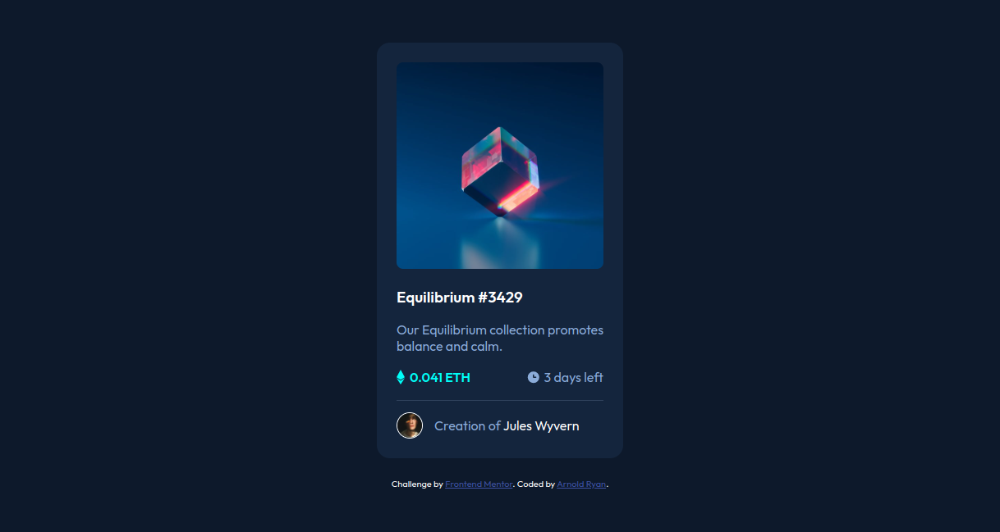

# Frontend Mentor - NFT preview card component solution

This is a solution to the [NFT preview card component challenge on Frontend Mentor](https://www.frontendmentor.io/challenges/nft-preview-card-component-SbdUL_w0U).

## Table of contents

- [Overview](#overview)
  - [The challenge](#the-challenge)
  - [Screenshot](#screenshot)
  - [Links](#links)
- [My process](#my-process)
  - [Built with](#built-with)
  - [What I learned](#what-i-learned)
  - [Continued development](#continued-development)
  - [Useful resources](#useful-resources)
- [Author](#author)

## Overview

### The challenge

Users should be able to:

- View the optimal layout depending on their device's screen size
- See hover states for interactive elements

### Screenshot

### Links

- Solution URL: [Github Code](https://github.com/arnold-ryan/nft-preview-card-component-main)
- Live Site URL: [Live Site](https://arnold-nft-card.netlify.app/)

## My process

### Built with

- Semantic HTML5 markup
- CSS custom properties
- Flexbox

### What I learned

- Resizing svg images to fit a component.
- Adding different colors to different parts of a text using span element.
- Aligning items horizontally and vertically.
- Adding colored borders to images.

### Continued development

I'd like to continue learning flexbox and it's various complex use cases.

### Useful resources

- [Css Tricks](https://css-tricks.com/snippets/css/a-guide-to-flexbox/) - helped me with aligning items using css flex property

## Author

- Website - [Arnold Odhiambo](https://arnold-portfolio.netlify.app)
- Frontend Mentor - [@arnold-ryan](https://www.frontendmentor.io/profile/arnold-ryan
- LinkedIn - [Arnold Odhiambo](https://www.linkedin.com/in/arnold-odhiambo-dev/)
